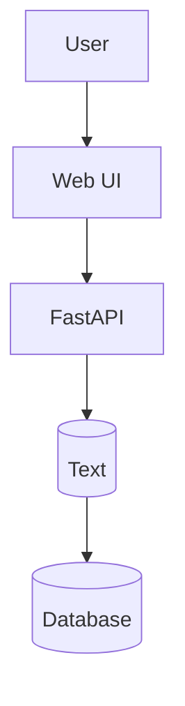
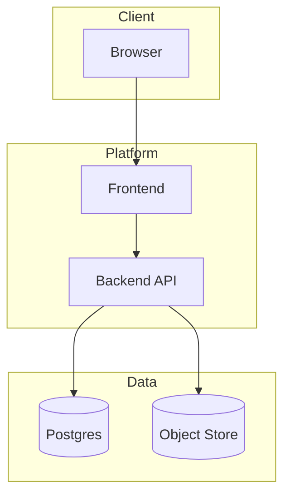
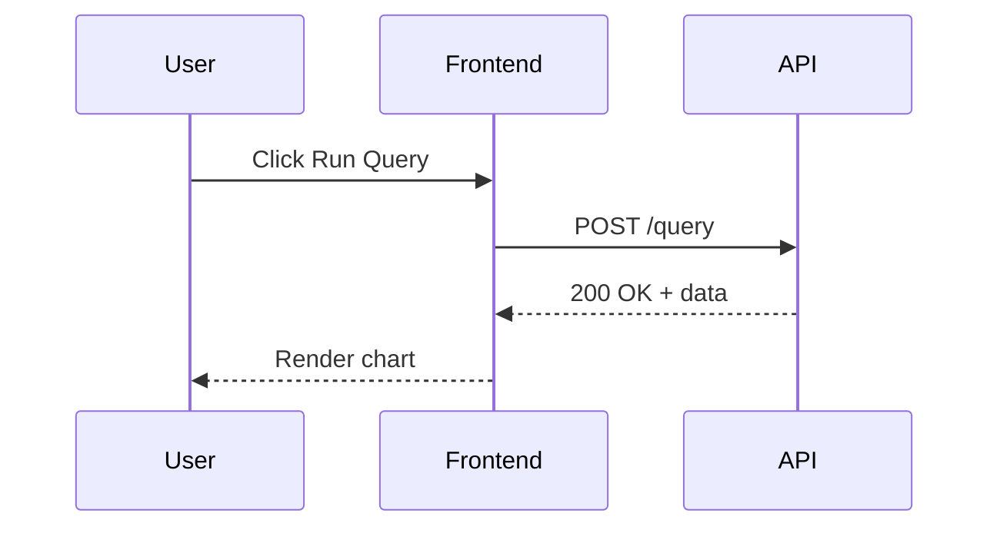

# Mermaid Basics for TEEHR Hub

This page is a minimal sandbox to learn Mermaid syntax before we draft project diagrams.

## How to Use This File

1. Open this file in VS Code.
2. Open Markdown preview.
3. Edit labels, arrows, and groups directly in the Mermaid blocks.
4. Save and confirm the diagram updates.

## Example 1: Basic Flowchart

Try editing:
- Change `LR` to `TD` to switch layout direction.
- Rename nodes, for example `API` to `FastAPI`.
- Add a step between `C` and `D`.

## Example 2: Grouped Components

Try editing:
- Rename subgraphs.
- Add another component in `Platform`.
- Add arrows to show more dependencies.

## Example 3: Simple Sequence Diagram

Try editing:
- Add a new participant like `Trino`.
- Insert a new request/response step.
- Change labels to match your own use case.

## Next Step

Once this feels comfortable, we can add repository-specific diagrams for:
- high-level architecture
- authentication flow
- data pipeline flow
- deployment view
