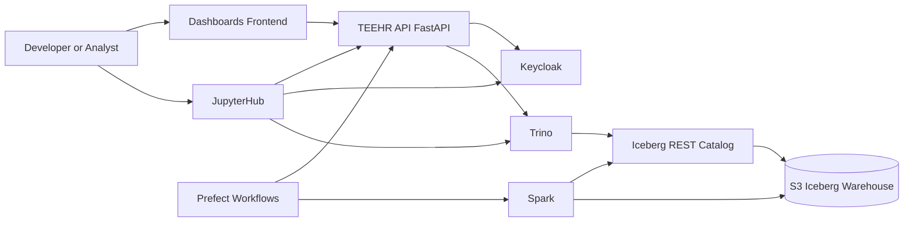
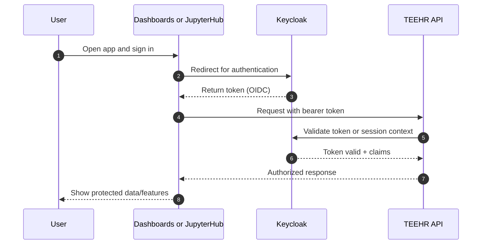
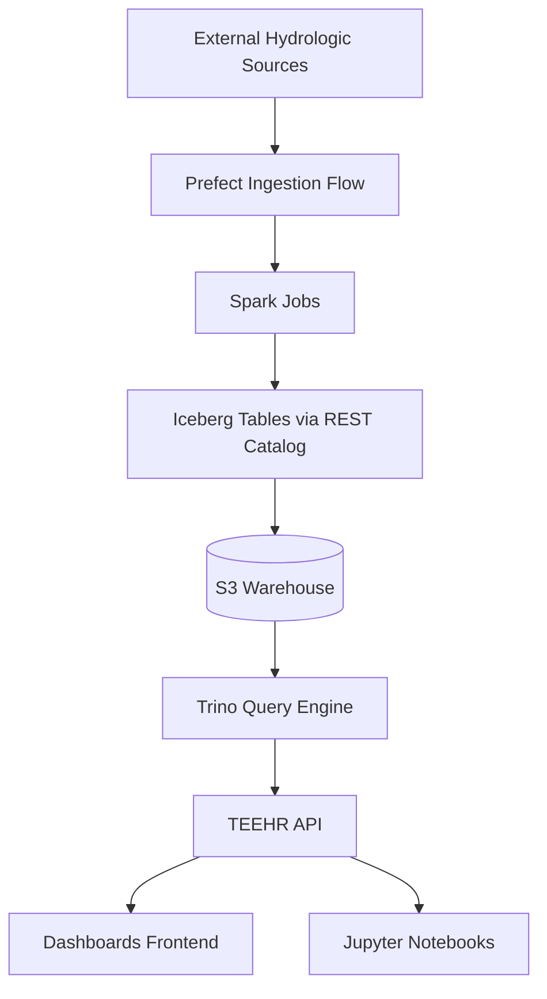
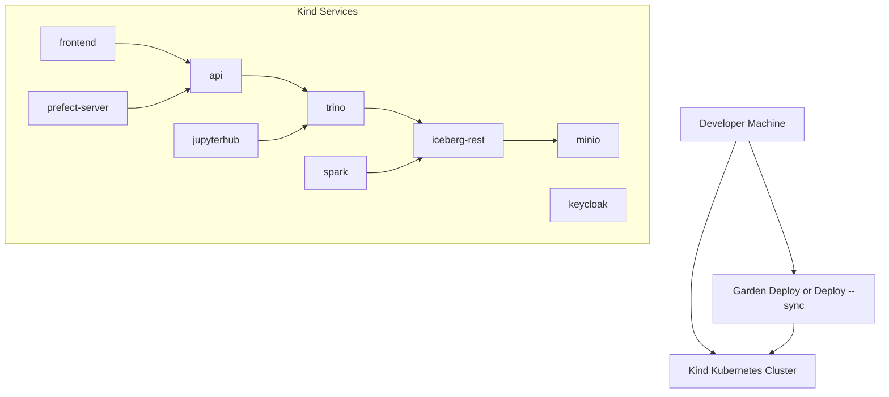

# TEEHR Hub Architecture Diagrams

This file contains editable Mermaid diagrams tailored to the current TEEHR Hub platform.

## 1) High-Level Platform Architecture

Notes:
- Captures user-facing entry points plus core compute and data services.
- Keeps storage shown at a high level for readability.

## 2) Authentication Flow (Keycloak + App Services)

Notes:
- Represents shared login pattern for UI and notebook-driven API access.
- Use this as the base for role/group-level authorization detail later.

## 3) Data Pipeline Flow (Ingest to Query)

Notes:
- Highlights operational path from ingestion through analytics consumption.
- Useful for discussing ownership, retries, and data freshness SLAs.

## 4) Local Development Deployment View (Kind + Garden)

Notes:
- Focuses on local cluster topology and service interactions.
- Keep this synchronized with Garden module names as they evolve.

## Editing Tips

1. For simpler layouts, change flow direction (`LR`, `TB`, `TD`).
2. Use `subgraph` blocks to reduce visual clutter.
3. Keep labels short; move details to nearby notes.
4. Split large diagrams into purpose-specific diagrams, as done here.
